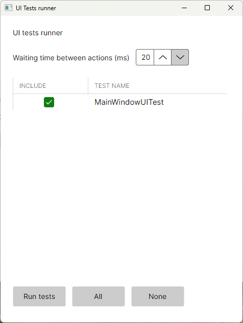
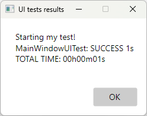

# AlexandreHtrb.AvaloniaUITest

This is a custom UI test framework for Avalonia, based on [Android Espresso](https://developer.android.com/training/testing/espresso).

These tests are visible and run on the live application, as if a real person was clicking on buttons and typing on text inputs.

The Example project in this repo is a kickstarting template.

## How to use it

1) Add the NuGet package to your project.

```xml
<ItemGroup>
  <PackageReference Include="Avalonia" Version="11.2.3" />
  <PackageReference Include="Avalonia.Controls.DataGrid" Version="11.2.3" />
  
  <!-- The version major and minor should be the same from Avalonia above. -->
  <PackageReference Include="AlexandreHtrb.AvaloniaUITest" Version="11.2.*" />
</ItemGroup>
```

2) Because the UI tests runner dialog uses a DataGrid, you need to include DataGrid XAML styles in your App.xaml.

```xaml
<Application.Styles>
  <FluentTheme />
  <StyleInclude Source="avares://Avalonia.Controls.DataGrid/Themes/Fluent.xaml"/>
</Application.Styles>
```

3) Make a robot class for the view you want to perform actions.

In the view's .xaml file, the controls that will be tested need to have names.

```xaml
<TextBlock
  Name="tbCounter"
  Text="{Binding ClickedCounterMessage}"
  HorizontalAlignment="Center" />

<Button
  Name="btClick"
  Content="Click me"
  Command="{Binding ClickCmd}"
  HorizontalAlignment="Center" />
```

The robot class:

```cs
using AlexandreHtrb.AvaloniaUITest;

namespace MyApp.UITesting.Robots;

public sealed class MainWindowRobot : BaseRobot
{
    public MainWindowRobot(Control rootView) : base(rootView) { }
    
    internal TextBlock CounterMsg => GetChildView<TextBlock>("tbCounter")!;
    
    internal Button BtClick => GetChildView<Button>("btClick")!;
}
```

4) Make a UI test class.

```cs
using AlexandreHtrb.AvaloniaUITest;
using MyApp.UITesting.Robots;

namespace MyApp.UITesting.Tests;

public sealed class MainWindowUITest : UITest
{
    private MainWindowRobot Robot { get; }

    public MainWindowUITest()
    {
        var content = MainWindow.Instance!.Content;
        Robot = new((Control)content!);
    }

    public override async Task RunAsync()
    {
        AppendToLog("Starting my test!");

        Robot.CounterMsg.AssertIsVisible();
        Robot.BtClick.AssertIsVisible();
        Robot.CounterMsg.AssertHasText("Clicked 0 times");
        Robot.BtClick.AssertHasText("Click me");

        await Robot.BtClick.ClickOn();
        Robot.CounterMsg.AssertHasText("Clicked 1 times");
    }
}
```

5) Somewhere in your UI code, set-up a button or keybinding to open the UI tests runner dialog.

```cs
private void OpenUITestsRunnerDialog()
{
    UITestsPrepareWindowViewModel vm = new(
        defaultActionWaitingTimeInMs: 20,
        uiTests: [
            // insert your UI test classes here.
            new MainWindowUITest()
        ],
        uiTestsFinishedCallback: (resultsLog) =>
        {
            // you can customize this callback.
            Dialogs.ShowDialog(
                title: "UI tests results",
                message: resultsLog,
                buttons: ButtonEnum.Ok);
        });
    UITestsPrepareWindow uiTestsPrepareWindow = new(vm);
    uiTestsPrepareWindow.Show(MainWindow.Instance!);
}
```

The method above will open a dialog like this:



Click on "Run tests" to run the tests marked in the grid. With the code above, when the tests are finished:



## Custom UI assertions and actions

Custom actions:

```cs
using static AlexandreHtrb.AvaloniaUITest.UITestActions;

namespace MyApp.UITesting;

public static class CustomUITestActions
{
    // declare your custom actions here

    public static async Task TypeText(this TextEditor editor, string txt)
    {
        foreach (char c in txt)
        {
            editor.Document.Insert(editor.Document.TextLength, c.ToString());
        }
        await WaitAfterActionAsync();
    }
}
```

Custom assertions:

```cs
using static AlexandreHtrb.AvaloniaUITest.UITestAssertions;

namespace MyApp.UITesting;

public static class CustomUITestAssertions
{
    // declare your custom assertions here

    public static void AssertHasText(this TextEditor txtEditor, string txt) =>
        AssertCondition(
            txtEditor.Document.Text == txt,
            $"Text should be: '{txt}', reality: '{txtEditor.Document.Text}'.");
}
```

## Conditional compilation

Alter the csproj to include UI tests only on Debug mode or when UITestsEnabled flag is specified:

```xml
<PropertyGroup>
  <!--
    line below will include UI_TESTS_ENABLED preprocessor directive
    when "-p:UITestsEnabled" is specified in dotnet build, run or publish
  -->
  <DefineConstants Condition=" '$(UITestsEnabled)' == 'true' ">$(DefineConstants);UI_TESTS_ENABLED</DefineConstants>
</PropertyGroup>

<!-- Removes UI tests code in release versions that are not flagged for UI tests -->
<ItemGroup Condition="'$(Configuration)'=='Release' And '$(UITestsEnabled)' == 'false'">
  <Compile Remove="UITesting\**" />
  <Content Include="UITesting\**" />
</ItemGroup>

<ItemGroup>
  <PackageReference
    Include="AlexandreHtrb.AvaloniaUITest" Version="11.2.*"
    Condition="'$(Configuration)'=='Debug' Or '$(UITestsEnabled)' == 'true'"   />
</ItemGroup>
```

In your code, change the method that opens the UI tests runner dialog for conditional compilation:

```cs
#if DEBUG || UI_TESTS_ENABLED
    private void OpenUITestsRunnerDialog()
    {
        /* code here */
    }
#else
    private Task RunUITestsAsync() => Task.CompletedTask;
#endif
```

If you want to enable UI testing when publishing:

```sh
dotnet publish --configuration Release -p:UITestsEnabled=true
```
